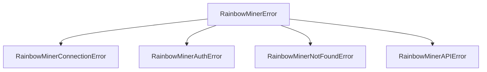

# Error handling

All exceptions raised by the client derive from `RainbowMinerError`, so you can
catch any library-specific error with a single `except` clause — or handle
specific cases individually.

## Exception hierarchy



| Exception | When raised |
| --------- | ----------- |
| `RainbowMinerError` | Base class for all library errors |
| `RainbowMinerConnectionError` | Cannot connect to the RainbowMiner API server |
| `RainbowMinerAuthError` | Server returns HTTP 401 Unauthorized |
| `RainbowMinerNotFoundError` | Server returns HTTP 404 for the requested resource |
| `RainbowMinerAPIError` | Any other non-2xx HTTP status; carries `.status_code` |

## Catching all library errors

```python
from rainbowminer_api_client import (
    RainbowMinerClient,
    RainbowMinerError,
)


async with RainbowMinerClient("192.168.1.50", 4000) as client:
    try:
        profit = await client.get_current_profit()
        print(f"Profit: {profit.ProfitBTC} BTC")
    except RainbowMinerError as e:
        print(f"Library error: {e}")
```

## Handling specific errors

```python
from rainbowminer_api_client import (
    RainbowMinerClient,
    RainbowMinerAuthError,
    RainbowMinerConnectionError,
    RainbowMinerError,
)


async with RainbowMinerClient(
    "192.168.1.50", 4000, username="admin", password="secret"
) as client:
    try:
        status = await client.get_status()
    except RainbowMinerAuthError:
        print("Authentication failed — check your username/password")
    except RainbowMinerConnectionError:
        print("Cannot connect to RainbowMiner — is it running?")
    except RainbowMinerError as e:
        print(f"API error: {e}")
```

## Inspecting HTTP status codes

`RainbowMinerAPIError` exposes the HTTP status code:

```python
from rainbowminer_api_client import (
    SyncRainbowMinerClient,
    RainbowMinerAPIError,
)


with SyncRainbowMinerClient("192.168.1.50", 4000) as client:
    try:
        client.reboot()
    except RainbowMinerAPIError as e:
        print(f"HTTP {e.status_code}: {e}")
        if e.status_code >= 500:
            print("Server error — try again later")
```

## Practical patterns

### Retry on connection errors

```python
import asyncio

from rainbowminer_api_client import (
    RainbowMinerClient,
    RainbowMinerConnectionError,
)


async def with_retry(client: RainbowMinerClient, max_retries: int = 3):
    for attempt in range(max_retries):
        try:
            return await client.get_current_profit()
        except RainbowMinerConnectionError:
            if attempt == max_retries - 1:
                raise
            await asyncio.sleep(2 ** attempt)
```

### Home Assistant integration

In a Home Assistant integration, catch `RainbowMinerError` at the coordinator
level so transient errors don't crash the integration:

```python
from rainbowminer_api_client import RainbowMinerError


async def async_update_data(self):
    try:
        return await self.client.get_current_profit()
    except RainbowMinerError as err:
        raise UpdateFailed(f"RainbowMiner error: {err}") from err
```

## Next steps

- [:octicons-arrow-right-24: API reference — Errors](../reference/errors.md) — auto-generated exception docs
- [:octicons-arrow-right-24: Sync / async parity](sync-async-parity.md) — choose the right client
